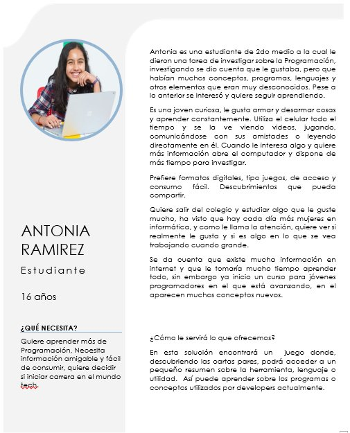
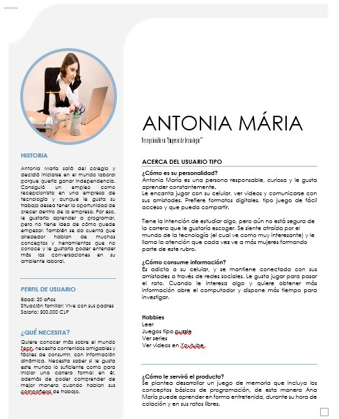
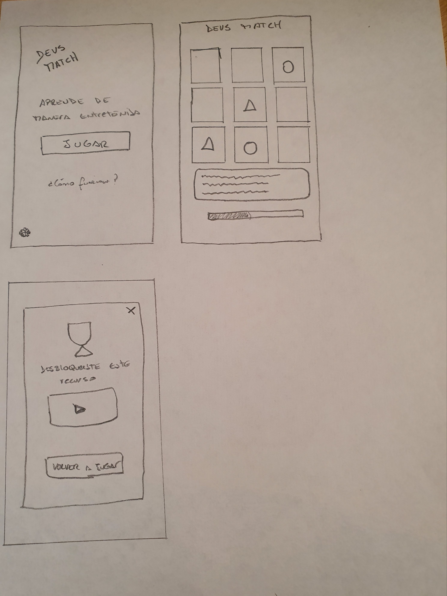
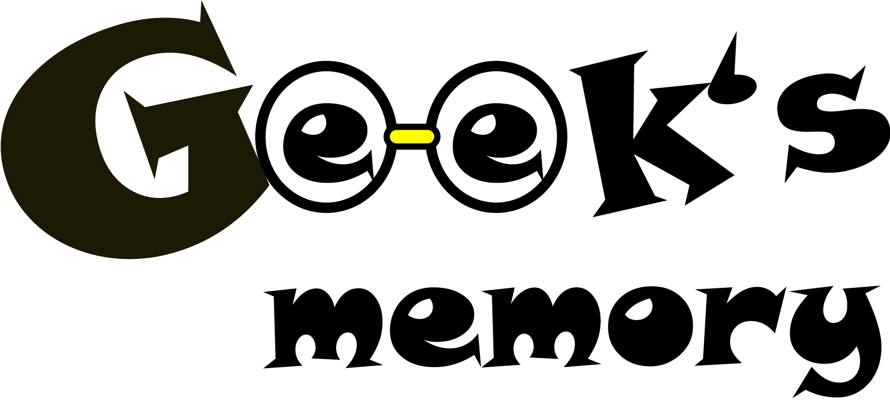
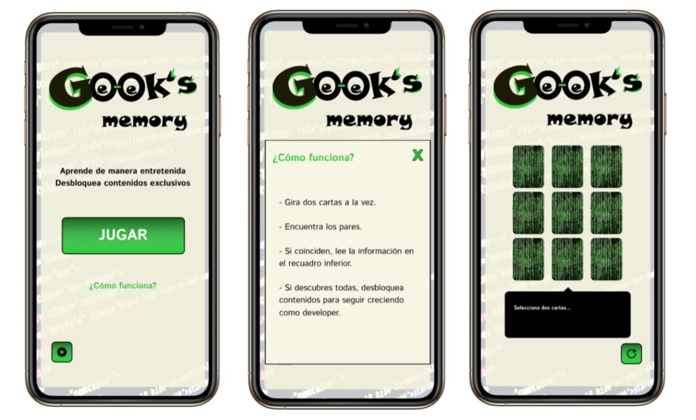
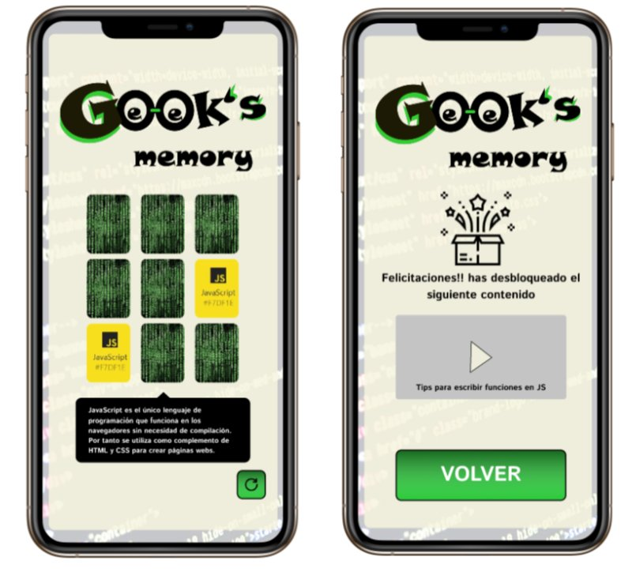
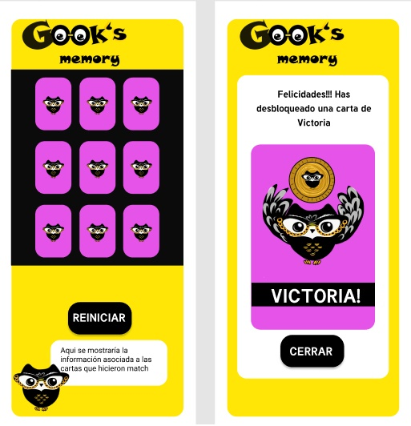
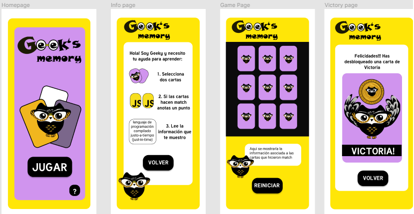

# Memory Match Game: Geek's memory

## Índice

* [1. Organizacion y planificación](#1-Organización_y_planificacion)
* [2. UX](#2-UX)
* [3. DISEÑO DE DISPLAYS: Html y CSS](#3-DISEÑO_DE_DISPLAYS_Html_CSS)

***

## 1. ORGANIZACIÓN Y PLANIFICACIÓN

  ### 1.2 LECTURA CONJUNTA README
      Antes de empezar la división del trabajo, se hizo una lectura conjunta del readme, seguida de una discusión respecto a la interpretación realizada por cada una respecto a los objetivos y alcances del desarrollo de la app.

  ### 1.2 DESARROLLO DE ESQUEMA CON DIVISIÓN GENERAL DEL TRABAJO
      Dada la confusión que despierta la revisión de un bloque de información nuevo, decidimos realizar un esquema general que englobara los puntos más relevantes de la lectura previa realizada al readme. Este esquema fue la base inicial con la que se trabajó para dividir tareas en equipo.

## 2. UX DESIGN

  ### 2.1 DESARROLLO DE USUARIO TIPO
  Para el desarrollo del usuario tipo, que sería la base de toda la fase de diseño, trabajamos inicialmente en forma individual, desarrollando separadamente dos usuarios tipos. Posteriormmente se desarrolló un usuario que mostrara características mixtas (un poco de cada usuario)

  #### 2.1.1 USUARIOS INDIVIDUALES
  *ANTONIA RAMIREZ
  ***
  Joven estudiante, que después de haber recibido una asignación de programación siente interés al respecto, y desea ahondar en el tema, pero en una forma entretenida. Le gustan los juegos, y pasa mucho tiempo conectada en el celular.

  

  *ANA MARIA PEREZ
  ***
  Ana Maria es una joven recepcionista en una empresa tech, ella desea mejorar sus posibilidades de lograr un ascenso, y para ello desea conocer los términos básicos de programación. Como ella realiza un trabajo cargado de presión, necesita que la información sea presentada en forma simple.

  

  #### 2.1.2 UNIFICACIÓN DEL USUARIO TIPO
  Basándonos en las características de ambos perfiles, creados en forma individual, se crea el usuario Antonia María, que es una mezcla de ellos.
  Antonia María es una joven que recién culmina sus estudios en la media, y no sabe que carrera desea cursar, por ese motivo toma un trabajo como recepcionista en una empresa tech. Luego de unos meses, comprende que necesita un trabajo que represente un mayor reto, y que, además, le permita desarrollarse en forma profesional, por eso, desea evaluar si el mundo tech, le resulta en efecto interesante, pero las obligaciones en su trabajo la dejan agotada, y no tiene las energías como para iniciar tomando un curso formal.

  

  #### 2.1.3 SOLUCIÓN A LA NECESIDAD DEL USUARIO CREADO

  Como respuesta a la necesidad de Antonia María, quien es una persona joven (20 años), que desea abrirse paso en el mundo de la tecnología, se propone el desarrollo de un juego de memoria, el cual, además de funcionar para fines lúdicos, también permita en una manera poco invasiva, que Antonia María se vaya familiarizando con las generalidades del mundo de los desarrolladores web, ayudándola así, a que defina el área profesional en la que desea incursionar.
  Siendo que ella se conecta constantemente a través de su teléfono, creemos que, una app tipo juego puede solventar en forma eficiente esta necesidad.

### 2.2 PROTOTIPO DE BAJA FIDELIDAD
Se desarrollaron dos prototipos, en los que, cada una reflejó su percepción de la manera en la que debía desarrollarse la app.
Una vez cada uno tuvo su esquema en papel, procedimos a comparar , y a plantear una manera global que incluyera las mejores ideas de ambos desarrollos.

*MODELO A

 

*MODELO B

 

  #### 2.2.1 Esquematizacion general
  Partiendo de ambos modelos desarrollados, se obtuvo el siguiente esquema, que muestra el funcionamiento de la app.

  Objetivos:
  * Entender funcionamiento de la app (Facilita desarrollo del código).

  * Jerarquizar tareas, dando prioridad a los elementos primarios.

  * Tener una base común para desarrollo prototipo de alta fidelidad
  
  

  ***
  Leyenda
  * Cuadro amarillo: display primario (elemento fundamental para el funcionamiento de la app)
  * Circulo verde agua: Botones primarios 
  * Cuadro naranja: display secundario (elemento que enriquece el diseño de la app, pero cuya presencia no es vital para la funcionalidad de la app)
  * Circulo azul: Botones secundarios

### 2.3 ELEMENTOS CARACTERÍSCOS DE LA APP
A fin de caracterizar la app, se diseñó un logo con el nombre, y se seleccionó una mascosta que guiara al jugador durante el desarrollo de la partida.

#### 2.3.1 Historias de usuario
A fin de generar un diseño que estuviera adaptado a las necesidades del usuario, se trabajó en base a "historias de usuario", las cuales, además de ayudarnos a definir la app por etapas, también nos permitieron ocupar la "perspectiva del usuario", pensando en la aplicación de una manera más funcional que práctica.

### Primera historia de usuario: "Necesito entender cómo funciona el juego"
      * Solución: Crear display con instrucciones y un botón que permita acceder a él
      * Criterios mínimos de aceptación: Que al hacer click en el botón se muestre cuadro emergente con texto de instrucciones.
       * Product Backlog: 
            a. Display página de inicio
            b. colocar botón "?" en la página de inicio.
            c. dar funcionalidad al botón para ir desde pagina de inicio hasta las página de instrucciones
            d. Crear display de instrucciones
            e. Escribir instrucciones
            f. Añadir estilo de acuerdo al diseño de figma
            g. Diseñar en forma responsiva

###  Segunda historia de usuario: "Que sea un juego desafiante en cada mano"
      * Solución: Barajar cartas usando algoritmo de fisher- Yates en forma correcta
      * Criterios mínimos de aceptación: Que se genere un nuevo orden aleatorio en cada mano, que al hacer click en el lugar donde se encuentra la carta se muestre la imagen importada desde la carpeta de componentes.
       * Product Backlog: 
            a. Diseñar cartas.
            b. "Llamar" cartas desde carpeta de componentes.
            c. Lograr que al hacer click se muestre componente: "js", "git", "html", "css"... segun corresponda.
            d. Manipular elementos contenidos en un objeto en forma satisfactoria
            e. Generar objeto inicial ( conteniendo 4 componentes que a su vez deben ser duplicados)
            f. Implementar sobre ese objeto el algoritmo de Fisher- Yates para generar orden aleatorio
            g. Usar ese objeto con orden aleatorio para mostrar juego en pantalla

### Tercera historia de usuario: "Necesito saber para que sirve la herramienta descubierta en la carta (imagen en la carta webdev de memoria)"
      * Solución: Cuadro de texto breve con definición de la imagen que se muestra en la carta
      * Criterios mínimos de aceptación: Que se muestre un imput type text con la información requerida
       * Product Backlog: 

### Cuarta historia de usuario: "Quiero saber si se cumple el objetivo (si gané)"
      * Solución: Display que muestre carta y mensaje de victoria cuando se haga match con todas las cartas
      * Criterios mínimos de aceptación: Que se muestre mensaje de victoria
       * Product Backlog: 

### Quinta historia de usuario: "Quiero volver a jugar repetidas veces"
      * Solución: Incluir botón "reset" que active algoritmo de fisher-yates, y retorne a la página de juego.
      * Criterios mínimos de aceptación: Que el botón reset genere un nuevo orden de cartas
       * Product Backlog: 

### Metodología de trabajo
Como herramienta visual para desarrollar las historias, y para organizar tareas y flujo de trabajo, implementamos el uso de un tablero TRELLO, siguiendo la siguiente estructura de trabajo:

    1. Definimos historia de usuario
    2. Se escribió una solución a la necesidad manifestada en la historia
    3. Se definió un criterio mínimo de aceptación para dar la historia por completada
    4. Se desarrolló el Product Backlog, el cual define la historia en términos de tareas a ejecutar para garantizar su cumplimiento.
    5. Definimos metas basándonos en el product backlog, definiendo tareas específicas para cada una durante el sprint en curso.
    6. Trabajamos con tres columnas para manejar el flujo de trabajo: 

        *To Do: Planeado para desarrollar en el sprint/ tarea que aun no ha sido tomada por ningún mienbro del equipo.

        * Doing: Esta es la sección de las tareas que están siendo trabajadas. Para llevar un orden, especificamos el miembro del equipo que la estaba desarrollando.

        * Done: Acá especificamos las tareas completadas de la historia de usuario en curso, cuando se hace cierre de una historia, las tareas completadas pasan a la columna historial, de esta manera evitamos que el tablero se recargue visualmente.

## 2.3.2 Selección del nombre/ creación del logo

Nombre: Siendo que se trata de una aplicación para personas interesadas en eel mundo de la tecnología, se tomaron en consideración nombres que pudieran ser asociados con esta temática.

Logo: Tomando como referencia el nombre seleccionado (Geek´s memory), se diseñó logo:

 

Mascota: Se diseñó un personaje que pudiera ser la imagen de la app ("Geeky")

 

## 2.4 PROTOTIPO DE ALTA FIDELIDAD

Se desarrollaron dos modelos, para luego someter a testeo:

*MODELO A

 

  

***
*MODELO B

 

  

#### 2.4.1 FEEDBACK
En base a las observaciones recibidas, se realizaron  modificaciones, resultando el diseño, en base al cual se programaría la app:

## 3. DISEÑO DE DISPLAYS: HTML Y CSS

### 3.1 HTML
En el archivo Html se estructuraron en secciones todas las vistas del usuario con sus respectivas id que permite a traves de JavaScript mostrar u ocultar cada una, estas son: Home Page, Game Page, Instructions Page y Victory Page.

Algunas de las clases utilizadas se repetian en las distintas páginas, lo que fue importante de detectar, ya que, en un inicio nos habiamos dividido la realización de las páginas en el equipo y luego nos dimos cuenta que eran componentes los que debiamos crear para reutilizarlos en las distintas páginas. De tal manera que unificamos para hacer más eficiente el codigo y darle mejor experiencia al usuario.

### 3.2 CSS
En la creación del CSS teniamos la tarea de crear una aplicación responsiva, esto es, que se pueda ver de buena manera en distintos tamaños de pantallas.

Para realizarlo, utilizamos en el Html la etiqueta viewport que nos permite definir el área para renderizar las páginas y desde el CSS con una consulta @media poder identificar desde que dispositivo esta viendo la página el usuario para brindarle una óptima experiencia y ajuste a las resoluciones de su dispositivo.

#### <b>Definimos tres tipos de pantallas:</b>

- Movil: @media only screen and (max-width: 430px) <b>Asignada por defecto.</b>
- Tablet: @media only screen and (min-width: 431px)
- Desktop: @media only screen and (min-width: 769px)

Así, en la medida que detecta el tamaño de las pantallas se despliegan propiedades de CSS distintas que dan mejor aspecto a la aplicación. 

#### 3.2.1 Efectos de las cartas
Un elemento considerado para darle más movimiento y aspecto lúdico al Memory Match fue el diseño de animaciones y transiciones.

La siguiente animación permite que las cartas aparezcan en 1 segundo despues de cargar la página, llamando la animación desde la clase cards.

    @keyframes appear {
    from {opacity: 0;}
    to {opacity: 1;}
    } 

    .cards{
    ..
    animation-name: appear;
    animation-duration: 1s;
    ..}

Para poder voltear las cartas se hizo una adaptación del efecto flip, documentado aquí:  https://codepen.io/desandro/pen/LmWoWe

Esto utiliza funciones 3D (transition: transform 1s;
  transform-style: preserve-3d;) y rotación en el eje Y (transform: rotateY(180deg)) para generar el efecto deseado. Lo que nos permite que cuando el usuario haga click se voltee la carta que desea y posteriormente pasa a un ciclo condicional en donde, si las cartas coinciden se quedan volteadas, sino, se ocultan nuevamente para que el usuario siga descubriendolas.
